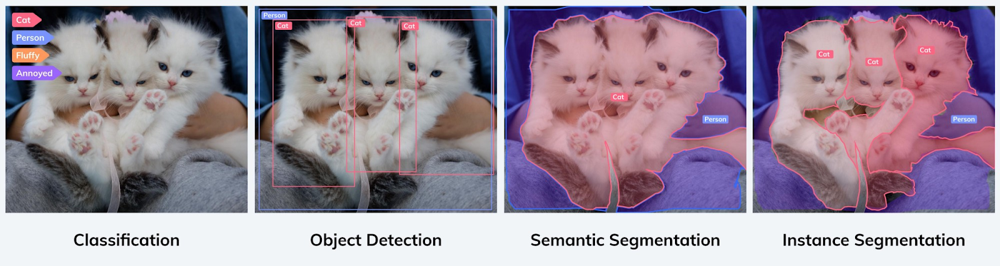

# CV notes

These are notes from learning CV. It's mainly focused on practical side describing libraries like OpenCV, platforms like HuggingFace.

## Terms

Terms from CV.

### Backbone

The backbone refers to the network which takes as input the image and extracts the feature map upon which the rest of the network is based.

### You Only Look Once (YOLO)

State-of-the-art, real-time object detection system. It doesn't use sliding window (like solutions before), instead it divide image on $ S \cdot S $ subpictures and analize them separetly. For every subpicture it return vector containing:

- p - probability that object occures in box,
- x and y - coordinate of upper left corner of object bounding box,
- w and h - width and height of bounding box,
- c1, ..., ck - classes representing objects.

## Segmentation



### Panoptic Segmentation

Whole picture is segmented. Otherwords every pixel is assign to class.

## Additional infos

To install `detectron2` library run:

```bash
poetry
python -m pip install 'git+https://github.com/facebookresearch/detectron2.git'
```
